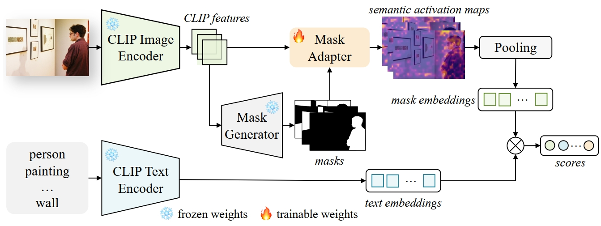

<div align ="center">

<h1> Mask-Adapter </h1>
<h3> The Devil is in the Masks for Open-Vocabulary Segmentation </h3>

Yongkang Li<sup>\*</sup>, [Tianheng Cheng](https://scholar.google.com/citations?user=PH8rJHYAAAAJ&hl=zh-CN)<sup>\*</sup>, [Bin Feng](https://scholar.google.com/citations?user=nRc8u6gAAAAJ&hl=zh-CN), [Wenyu Liu](http://eic.hust.edu.cn/professor/liuwenyu), [Xinggang Wang](https://xwcv.github.io/)<sup>📧</sup>

Huazhong University of Science and Technology,

<b>CVPR 2025</b>

(\* equal contribution, 📧 corresponding author)

[](https://arxiv.org/abs/2412.04533)
[](https://huggingface.co/owl10/Mask-Adapter)
[](https://huggingface.co/spaces/wondervictor/Mask-Adapter)

[](https://paperswithcode.com/sota/open-vocabulary-semantic-segmentation-on-2?p=mask-adapter-the-devil-is-in-the-masks-for)
[](https://paperswithcode.com/sota/open-vocabulary-semantic-segmentation-on-3?p=mask-adapter-the-devil-is-in-the-masks-for)
[](https://paperswithcode.com/sota/open-vocabulary-semantic-segmentation-on-7?p=mask-adapter-the-devil-is-in-the-masks-for)
[](https://paperswithcode.com/sota/open-vocabulary-semantic-segmentation-on-1?p=mask-adapter-the-devil-is-in-the-masks-for)
</div>


<div align="center">

</div>

## Highlights

* Mask-Adapter is a simple yet remarkably effective method and can be seamlessly integrated into open-vocabulary segmentation methods, e.g., [FC-CLIP](https://github.com/bytedance/fc-clip) and [MAFT-Plus](https://github.com/jiaosiyu1999/MAFT-Plus), to tackle the existing bottlenecks.

* Mask-Adapter effectively extends to SAM without training, achieving impressive results across multiple open-vocabulary segmentation benchmarks.

## Updates
- [x] Release code
- [x] Release weights
- [x] Release demo with SAM-2👉 [🤗 Mask-Adapter](https://huggingface.co/spaces/wondervictor/Mask-Adapter)
- [ ] Release weights training with addtional data


## Getting Started
+ [Installation](INSTALL.md).

+ [Preparing Datasets for Mask-Adapter](datasets/README.md).

+ [Getting Started with Mask-Adapter](GETTING_STARTED.md).

## Models

| Model | Backbone | A-847 | A-150 | PC-459 | PC-59 | PAS-20 | Download |
|:----- |:---------|:---:|:---:|:---:|:---:|:---:|:---:|
|FC-CLIP|ConvNeXt-L|14.8|34.1|18.2|58.4|95.4|[model](https://drive.google.com/file/d/1-91PIns86vyNaL3CzMmDD39zKGnPMtvj/view?usp=sharing) |
|FC-CLIP + Mask-Adapter|ConvNeXt-L|14.1|36.6|19.3|59.7|95.5|[model](https://drive.google.com/file/d/13_sr30_Q0Geubijik0BpVC_JgyFAmyQU/view?usp=sharing) |
|MAFTP-Base|ConvNeXt-B|13.8|34.5|18.5|57.5|95.5|[model](https://drive.google.com/file/d/1BeEeKOnWWIWIH-QWK_zLhAPUzCOnHuFG/view?usp=sharing)|
|MAFTP-Base + Mask-Adapter|ConvNeXt-B|14.2|35.6|17.9|58.4|95.1 |[model](https://drive.google.com/file/d/1v0rdETOJl6oOKmef1L7WbtG16-zKvp2b/view?usp=sharing)|
|MAFTP-Large|ConvNeXt-L|15.5|36.3|21.2|59.5|96.4|[model](https://drive.google.com/file/d/1EQo5guVuKkSSZj4bv0FQN_4X9h_Rwfe5/view?usp=sharing) |
|MAFTP-Large + Mask-Adapter|ConvNeXt-L|16.2|38.2|22.7|60.4|95.8 |[model](https://drive.google.com/file/d/12eqDnTYaQlj9QUmWO1Vh9vvB81tKABl5/view?usp=sharing) |

## Citation
If you Mask-Adapter useful in your research or applications, please consider giving us a star &#127775; and citing it by the following BibTeX entry.

```BibTeX
@article{li2024maskadapter,
      title={Mask-Adapter: The Devil is in the Masks for Open-Vocabulary Segmentation}, 
      author={Yongkang Li and Tianheng Cheng and Wenyu Liu and Xinggang Wang},
      year={2024},
      eprint={2412.04533},
      archivePrefix={arXiv},
      primaryClass={cs.CV},
      url={https://arxiv.org/abs/2412.04533}, 
}
```
## License
All code in this repository is under the [Apache License 2.0](https://www.apache.org/licenses/LICENSE-2.0).


## Acknowledgement

Mask-Adapter is based on the following projects: [detectron2](https://github.com/facebookresearch/detectron2), [Mask2Former](https://github.com/facebookresearch/Mask2Former), [FC-CLIP](https://github.com/bytedance/fc-clip) and [MAFTP](https://github.com/jiaosiyu1999/MAFT-Plus). Many thanks for their excellent contributions to the community.


